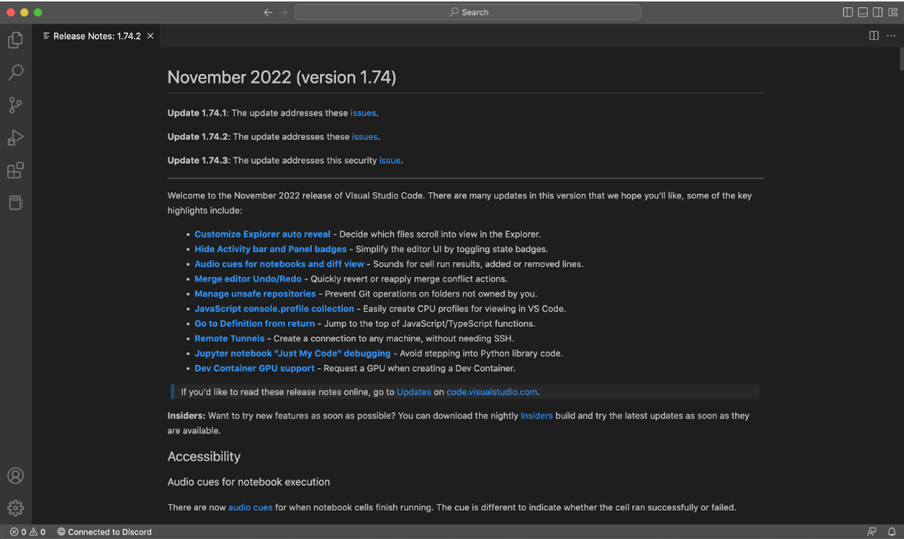
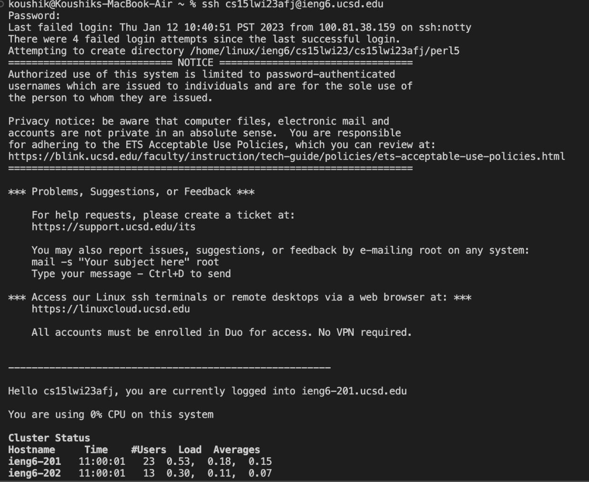
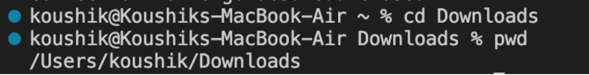
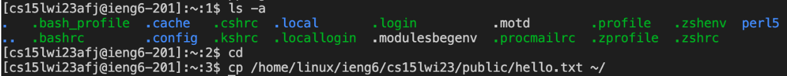

# Remote Access

## Step 1: Installing Visual Studio Code
* Go to [Visual Studio Code](https://code.visualstudio.com/) 
* Click the button labeled `Download` and select the OS that you are currently using
* Once the installer is finished downloading, double-click the file to open the installer
* Follow the steps on the installer to install VSCode
* Open VSCode and get accustomed to the layout of the software

## Step 2: Remotely Connecting
* Go to https://gitforwindows.org/ and follow the directions to download and install `git` 
* Locate and open the terminal in VSCode (using Ctrl or Command + `)
* Remotely connect to the `ieng6` server using the ssh command `ssh cs15lwi23zz@ieng6.ucsd.edu` with the zz replaced with the course specific username

You will likely see a message like:
`The authenticity of host 'ieng6.ucsd.edu (128.54.70.227)' can't be established.
RSA key fingerprint is SHA256:ksruYwhnYH+sySHnHAtLUHngrPEyZTDl/1x99wUQcec.
Are you sure you want to continue connecting (yes/no/[fingerprint])? `

* Type `yes` and press enter

## Step 2: Running Commands
* Use the terminal to run some commands such as: `cd, ls, pwd, mkdir`
* The `cd` command takes you to a specified directory in the current path
* The `mkdir` command makes a directory in the current path with a specified name
* The `pwd` command prints out the current path
* The `ls` command prints out all files in the current path
* The commands that I tried in the terminal all manipulated or retrieved the current path in some way
* Run the command `exit` to exit the terminal

