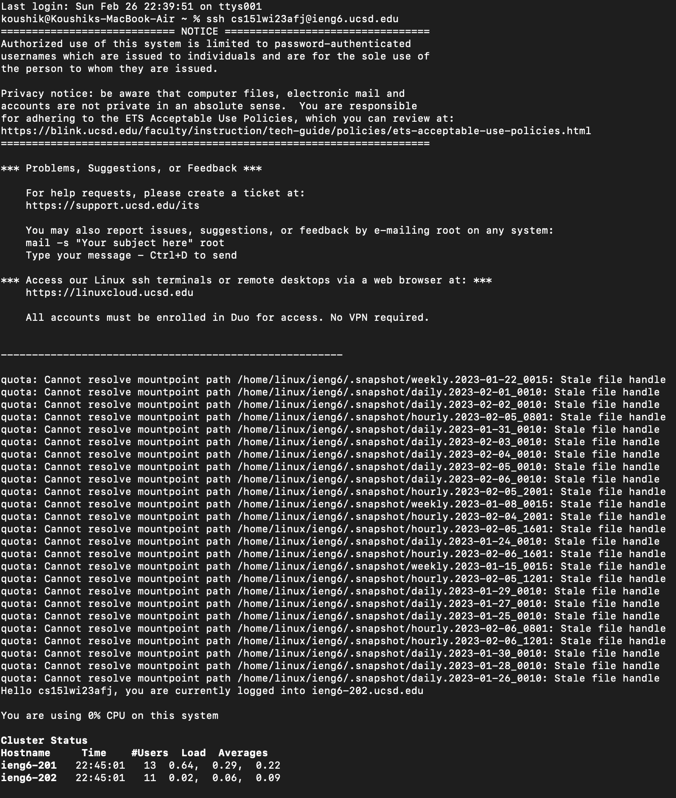
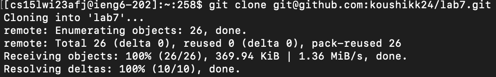
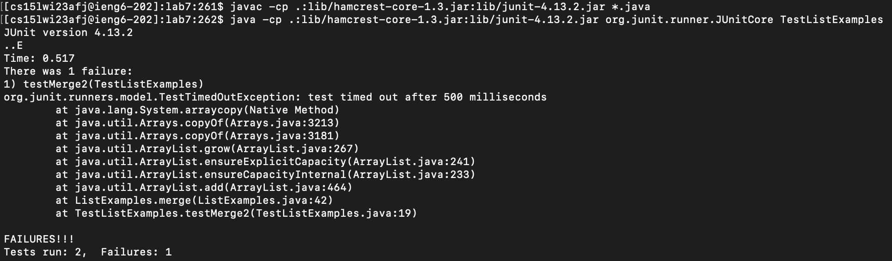
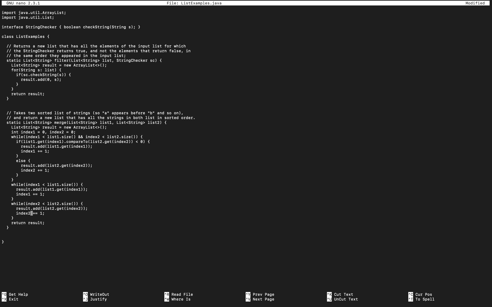
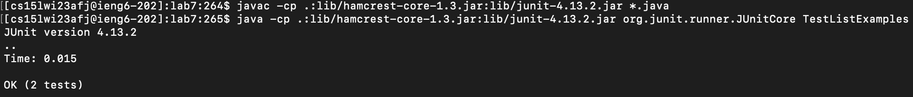
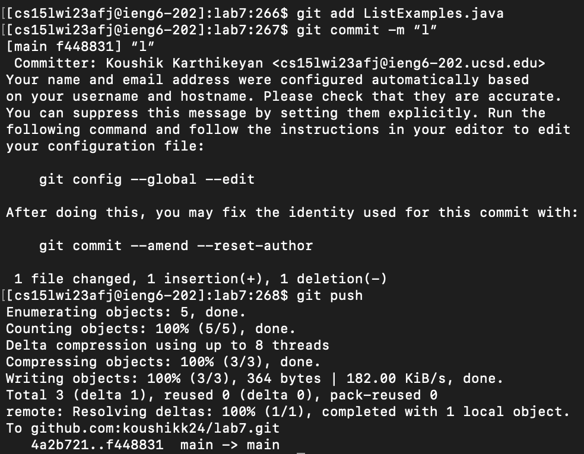

# Done Quick
## Step 4

Keys Pressed: `ssh cs15lwi23afj@ieng6.ucsd.edu`

I used the `ssh` command to login to the ieng6 machine.

## Step 5

Keys Pressed: `git clone git@github.com:koushikk24/lab7.git`, `cd lab7`

I used the `git clone` command to clone my lab7 repository fork onto the ieng6 machine.

## Step 6

Keys Pressed: `javac -cp .:lib/hamcrest-core-1.3.jar:lib/junit-4.13.2.jar *.java`, `java -cp .:lib/hamcrest-core-1.3.jar:lib/junit-4.13.2.jar org.junit.runner.JUnitCore TestListExamples`

I used the `javac` command to compile all the java files in the lab7 directory, Then I used the `java` command to run the TestListExamples JUnit tests.

## Step 7

Keys Pressed: `nano ListExamples.java`, `<right><right><right><right><right>`, `<del>`, `2`

I used the `nano` command to edit ListExamples.java and fix the error. I used the right keys to move my cursor to the error line and change the "index1" to "index2".

## Step 8

Keys Pressed: `<up><up><up><enter>, <up><up><up><enter>`

I used the up keys to get back to the `javac` command to recompile the java files. I again used the up keys to get back to the `java` command to rerun the TestListExamples JUnit tests.

## Step 9

Keys Pressed: `git add ListExamples.java`, `git commit -m “l”`, `git push`

I used the `git add` command to add the ListExamples.java file to my list of changed files. I used the `git commit` command to commit my changes. Finally, I used the `git push` command to push my local changes to my lab7 repository fork.
