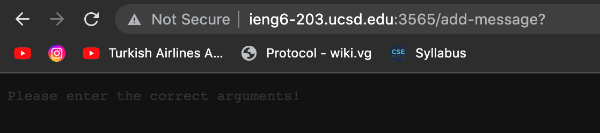
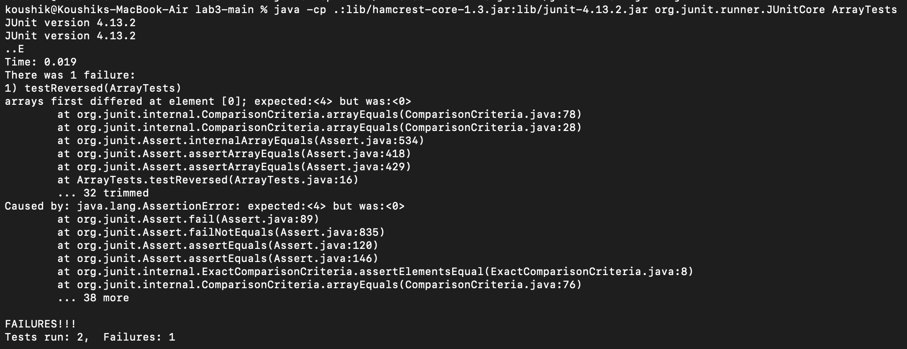

# Servers

**StringServer implementation:**
```
import java.io.IOException;
import java.net.URI;
import java.util.HashSet;
import java.util.Set;

/**
 * @author Koushik K.
 * @since 01/19/2023
 */
public class StringServer {

    /**
     * Main method
     * @param args The command line arguments
     * @throws IOException
     */
    public static void main(String[] args) throws IOException {

        // no port number
        if (args.length == 0) {
            System.out.println("Missing port number! Try any number between 1024 to 49151");
            return;
        }

        // given port number
        int port = Integer.parseInt(args[0]);

        // start the server
        Server.start(port, new Handler());
    }
}

/**
 * @author Koushik K.
 * @since 01/19/2023
 */
class Handler implements URLHandler {

    // list of strings
    StringBuilder message = new StringBuilder();

    /**
     * Handles a URL request
     * @param url The requested URL
     * @return The response
     */
    @Override
    public String handleRequest(URI url) {

        // add to list URL
        if (url.getPath().equalsIgnoreCase("/add-message")) {

            // String to add to list
            String[] add = url.getQuery().split("=");

            // check if string exists
            if (add[0].equalsIgnoreCase("s") && add.length == 2) {

                // add to list
                // build
                stringBuilder.append(add[1])
                        .append("\n");
            }

            // no arg
            else {

                // notify user the correct args
                return "Please enter the correct arguments!";
            }

            // full message
            return message.toString();
        }

        // invalid path
        else {
            System.out.println("Path: " + url.getPath() + ", Query: " + url.getQuery());
            return "404 Not Found!";
        }
    }
}

/**
 * @author Koushik K.
 * @since 01/19/2023
 */
class Handler implements URLHandler {

    // list of strings
    StringBuilder message = new StringBuilder();

    /**
     * Handles a URL request
     * @param url The requested URL
     * @return The response
     */
    @Override
    public String handleRequest(URI url) {

        // add to list URL
        if (url.getPath().equalsIgnoreCase("/add-message")) {

            // String to add to list
            String[] add = url.getQuery().split("=");

            // check if string exists
            if (add[0].equalsIgnoreCase("s") && add.length == 2) {

                // add to list
                // build
                stringBuilder.append(add[1])
                        .append("\n");
            }

            // no arg
            else {

                // notify user the correct args
                return "Please enter the correct arguments!";
            }

            // full message
            return message.toString();
        }

        // invalid path
        else {
            System.out.println("Path: " + url.getPath() + ", Query: " + url.getQuery());
            return "404 Not Found!";
        }
    }
}
```

## Argument 2:



* The `public String handleRequest(URI url)` method is called. 
* The only argument for the method is the URL of the request which contains the path and query information.
* The `StringBuilder message` field is updated because the query contains the new message information and therefore the code updates the messsage accordingly.

## Argument 2:


* The `public String handleRequest(URI url)` method is called. 
* The only argument for the method is the URL of the request which contains the path and query information.
* No value is changed because the query is invalid and therefore the code returns an invalid input prompt.

# Bugs

## Inputs

**Failure Inducing Input:**
```
@Test
  public void testReversed() {
    int[] input1 = { 1, 2, 3, 4 };
    assertArrayEquals(new int[] { 4, 3, 2, 1 }, ArrayExamples.reversed(input1));
  }
```

**Bug Report:**


**Non-Failure Inducing Input:**
```
@Test
  public void testReversed() {
    int[] input1 = { 0 };
    assertArrayEquals(new int[] { 0 }, ArrayExamples.reversed(input1));
  }
```

## Fix

**Provided:**
```
static int[] reversed(int[] arr) {
    int[] newArray = new int[arr.length];
    for(int i = 0; i < arr.length; i += 1) {
      arr[i] = newArray[arr.length - i - 1];
    }
    return arr;
  }
```

**Fixed:**
```
static int[] reversed(int[] arr) {
    int[] newArray = new int[arr.length];
    for(int i = 0; i < arr.length; i += 1) {
      newArray[arr.length - i - 1] = arr[i];
    }
    return newArray;
  }
```

# Learning

In this lab, I learned how to set up a web server using the Java URI API and I also learned how to use the ieng server to how the Java web server. I also learned how to use the JUnit API to test my program using the `@Test` tags and the `assertEquals` method.

